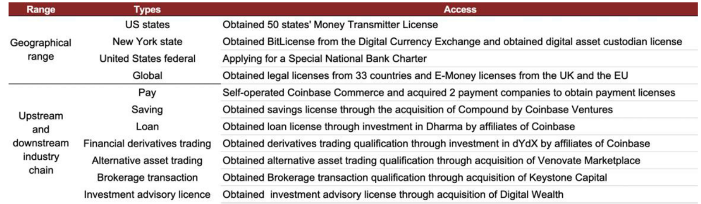

# PHBS_BlockChain_2018
## 1. Introduction 
Introduced under the pseudonym Satoshi Nakamoto in 2008, Bitcoin adopts a decentralized network architecture based on cryptography. With consensus achieved by a proof-of-work system, independent Bitcoin miners use their mining hardware to maintain and profit from the Bitcoin network. Users of the Bitcoin network receive and send Bitcoins through the peer-to-peer network without support from banks or other third parties.  

Given the expansion of the Bitcoin network and the rise in bitcoin prices, the Bitcoin network has encountered problems such as declining reward for miners and slower transaction processing speed. Along the way, Bitcoin mining chips, pools and farms, as well as cryptocurrency exchanges have entered the industry, and we believe the Bitcoin value chain is becoming centralized.

*Figure 1 The more centralized bitcoin value chain*

*Figure 2 The bitcoin value chain*

*Source:Wind info, Bloomberg*

From Figure 2, we can find that there are some key links in the Bitcoin value chain:

(1) **Bitcoin mining hardware**: the computing hardware that specializes in Bitcoin mining. A large number of specialized chips are combined to form computing hardware that offers much greater power efficiency and value for money compared with traditional chips (e.g., CPUs and GPUs).

(2) **Bitcoin miners**: people who create new blocks and are rewarded with Bitcoins and transaction fees. A Bitcoin miners’ reward is determined by factors such as the cost of Bitcoin mining hardware, electricity cost, hash rate of the Bitcoin network, computing power that the miner contributes and the price of Bitcoin.

(3) **Mining pools**: used to pool the resources of Bitcoin miners to mine Bitcoins based on agreed terms. If a mining pool creates a new block, the reward will be split among miners based on their contributions to the mining activity. Mining pools usually charge miners some fees. Joining mining pools can help miners reduce costs and generate more stable returns. Data from BTC.com suggest the top-6 mining pools control 72.9% of the total computing power, and less than 3% of computing power is controlled by independent miners. 

(4) **Bitcoin mining farms**: specialized data centers providing hosting service for Bitcoin mining hardware. Mining farms are mostly built in regions with low electricity costs to maximize returns. In China, mining farms are mostly built in regions with abundant electricity supply and low electricity costs, such as Inner Mongolia, Sichuan, the Yunnan-Guizhou Plateau and Xinjiang. Data from blockchain.info show that mining farms in China accounted for about 58% of global mining farms in 2018. 

(5) **Cryptocurrency exchanges**: provide the marketplace for crypto asset trading. The Bitcoin network allows only seven transactions to be processed per second due to the block size limit and cannot meet the fast-growing demand for Bitcoin trading. As a result, cryptocurrency exchanges have gained prominence. Cryptocurrency exchanges are marketplaces where customers trade fiat currencies for crypto assets, or trade crypto assets for other crypto assets. Meanwhile, cryptocurrency exchanges also provide financial services (e.g., leveraged trading). 

## 2. Bitcoin mining hardware

Bitcoin miners are rewarded with Bitcoin transaction fees and new Bitcoins for creating new blocks on the Bitcoin network through a proof-of-work mechanism. Miners’ costs include electricity cost, the cost of purchasing mining hardware and the depreciation cost of mining hardware. 

*Figure 3 The Avalon Miner*

*Figure 4 Technical parameters of typical Bitcoin mining hardware (power efficiency is the most important)*

*Source: zol.com.cn*

If used in Bitcoin mining, Intel’s latest CPU can provide a hash rate of 20M Hash/s and NVIDIA’s GPU can provide a hash rate of about 400M Hash/s. The Friedcat BE100 (specialized chip for Bitcoin mining introduced in 2012) can provide a hash rate of 850G Hash/s (1G=1,024M), and the Antminer S15 (specialized equipment for Bitcoin mining) can provide a hash rate of 28T Hash/s (1T=1,024G). The hash rate of Bitcoin mining hardware keeps rising, while the power consumption of the most advanced Bitcoin mining hardware has fallen to 1/10,000 of GPU’s power consumption. Using chips other than specialized chips to mine Bitcoins has become economically unfeasible. 

Holders of some crypto assets (e.g., Ether) believe it is unfair to use Application-Specific Integrated Circuits (ASICs) in mining. Therefore, adjustments have been made to weaken the advantage of ASICs in mining.

Power efficiency is an important factor to consider in the performance of chips for mining hardware. Chips for mining hardware are mostly manufactured using the most advanced semiconductor manufacturing technologies. Quarterly reports of TSMC show that the company’s most advanced manufacturing technologies (e.g., its 7nm technology) are mainly used to manufacture chips for Bitcoin mining hardware, chips for Apple’s smartphones and chips for NVIDIA’s GPUs. Meanwhile, producers of Bitcoin mining hardware are also developing technologies to reduce the power consumption of Bitcoin mining hardware. 

*Figure 5: Performance of major Bitcoin mining hardware*

## 3.Miners

Miners are rewarded with newly-issued Bitcoins as well as transaction fees by creating new blocks. Most miners join mining pools to work together with other miners. The reward for a miner is determined by factors such as the cost of mining hardware and electricity, hash rate of the Bitcoin network, Bitcoin price and computing power contributed by the miner. 

(1) Cost of mining hardware: Prices and computing power vary among different mining hardware. Generally speaking, newer generations have higher prices and computing power. 

(2) Electricity cost: Miners can reduce electricity cost by mining in places with lower electricity tariffs, or join mining farms with lower electricity tariffs.

(3) Hash rate of the Bitcoin network: Miners cannot control the hash rate of the Bitcoin network, which is determined by the Bitcoin price in the longer term. Rising Bitcoin prices will drive up the hash rate of the Bitcoin network.

(4) Computing power contributed by a miner is determined by the miner’s mining hardware. Given the relatively high hash rate of the Bitcoin network, it is difficult for independent miners to profit from Bitcoin mining. Most miners join mining pools to improve the computing power of a node and increase the odds of successfully mining Bitcoins. Miners share the rewards of the mining pool.

(5) Bitcoin price: Miners have no control over the Bitcoin price, which is determined by the market.

*Figure 6: Factors affecting the income of miners*

## 4.Mining pools

### 4.1 Mining pools control a rising portion of computing power

Mining pools are used to pool miners’ resources to mine Bitcoins based on agreed terms. Miners connected to the server of a mining pool work together in block creation, and they share the reward. The reward for block creation will be delivered to mining pools first, and mining pools will deliver the rewards to miners when the reward reaches a set level. Generally speaking, mining pools will charge miners some fees for providing mining pool services. 

Instead of mining independently, miners benefit from joining mining pools. First, it saves storage and bandwidth costs of running full nodes. Second, working and sharing with other miners allow for more stable returns. Hash rate of the Bitcoin network reached 38.88EH/s on December 3, 2018, and the hash rate of an Antminer S9 is 13.5TH/s, implying a theoretical reward of 0.00063 Bitcoins a day.

Data from BTC.com suggest that the top-6 mining pools control 72.9% of the total computing power of the Bitcoin network, and less than 3% of computing power is controlled by independent miners. Over the past year, 95% of Bitcoins were mined by mining pools.

*Figure 7: Breakdown of mining pools’ computing power*

*Source: btc.com*

Figure 8: How mining pools work

### 4.2 Mining pools’ business models and returns

To successfully mine Bitcoins, it is crucial to be the first in solving mathematical problems. Mining pools divide the difficulty of a new block (i.e. a mathematical problem) into smaller tasks for connected miners to work on, and reward miners with a “share” when they finish their tasks. Miners with higher computing power are more likely to find the right answers. Mining pools therefore often assign tasks according to miners’ computing power, and miners with higher computing power tend to receive more difficult tasks. Mining pools aggregate the computing power of various miners, and reward connected miners in two major approaches.

**► PPLNS (Pay Per Last N Shares)**: In this approach, reward for miners is correlated with the “shares” they contribute. For example, if A and B have respectively submitted three “shares” and five “shares” of possibly right answers, they will be rewarded 3/8 and 5/8 of the Bitcoins mined without regard to who provided the right answer.

**► PPS (Pay Per Share)**: In this approach, miners are rewarded completely based on their contribution of computing power. We assume the hash rate of the Bitcoin network is 100T Hash/s, the hash rate of a mining pool is 20T Hash/s, and a miner contributes computing power with a hash rate of 5T Hash/s. Under such a scenario, the miner should be theoretically rewarded with 90 Bitcoins a day in the “Pay Per Share” approach, whether or not the mining pool has successfully mined Bitcoins. 

The PPS approach offers more stable returns to miners than the PPLNS approach, as mining pools will be responsible for their own losses. Therefore, mining pools adopting the PPS approach usually charge higher fees (about 8%) compared with mining pools adopting the PPLNS approach (4–5%). 

## 5. Mining farms

Mining farms are data centers that provide hosting service for mining hardware. Mining farms usually operate in regions with low electricity cost, and they can improve returns on the back of this lower cost. In China, most mining farms are located in regions with abundant electricity supply and low electricity cost, such as Inner Mongolia, Sichuan, the Yunnan-Guizhou Plateau and Xinjiang. 

*Figure 9: A Bitcoin mining farm*

*Source: news.qq.com*

*Figure 10: Electricity tariffs in different countries*

*Source: Electricity Tariffs, Power Outages and Firm Performance*

Data from blockchain.info suggest that global electricity consumption of Bitcoin mining totaled 22.7bn kWh in 2017 and mining farms in China accounted for about 70% of that. However, plenty of mining farms in China have begun moving overseas as China tightens regulations on Bitcoin. For example, the PBoC1 issued on September 4, 2017 a document to restrict the operation of Bitcoin exchanges in China. In addition, a working group on internet finance discussed measures to guide the exit of mining farms in November 2017, and the PBoC has required local governments to gradually downsize Bitcoin mining farms by restricting power supply.

Places with cheap electricity and low temperatures are ideal for operating mining farms. Therefore, more and more mining farms have emerged in Canada, Russia and Iceland. Two large mining farms (BTC.Top and ViaBTC) have established subsidiaries in Canada, Iceland and the US.

Falling price of Bitcoin is putting pressure on mining farms. Bitcoin price stood at US$3,859 on December 4, 2018, down about 70% from the high level in early 2018. Mining returns are now insufficient to cover mining cost. Tencent News2 reported that some small and medium mining farms in Xinjiang and Inner Mongolia plan to exit the market due to cost pressure.

## 6. Exchanges and custodians

### 6.1 Regulators’ attitude towards cryptocurrency exchanges

**Mainland China**: the PBoC and six other government departments released a document on September 4, 2017 to shut down cryptocurrency exchanges. (Source: http://www.miit.gov.cn/n1146290/n4388791/c5781140/content.html)

**Hong Kong**: the Securities and Futures Commission released its Statement on regulatory framework for virtual asset portfolios managers, fund distributors and trading platform operators on November 1, 2018, and cryptocurrency exchanges became an experimental financial technology project in Hong Kong. If the project proves feasible, official licenses would be issued to cryptocurrency exchanges. (Source: https://www.sfc.hk/web/TC/news-and-announcements/policy-statements-and-announcemen ts/reg-framework-virtual-asset-portfolios-managers-fund-distributors-trading-platform-operat ors.html)

**US**: adopts an open attitude towards crypto assets but the US Securities and Exchange Commission (SEC), the US Commodity Futures Trading Commission (CFTC) and the US Internal Revenue Service (IRS) have laws and regulations for crypto assets. SEC believes that some crypto assets can be classified as securities. Meanwhile, cryptocurrency exchanges must be registered at or licensed by the SEC, and initial coin offerings (ICOs) must be registered and regulated. CFTC is in charge of Bitcoin futures trading and it considers crypto assets as a type of commodity. IRS considers Bitcoins and other crypto assets as assets rather than currencies.

**UK**: there are no laws and regulations on crypto assets and cryptocurrency exchanges yet. The overall regulatory climate is relatively loose, and ICO and cryptocurrency exchanges are not banned there. The country believes it is legal for institutional investors to trade crypto assets and the government should be responsible for supervising derivatives for crypto assets rather than crypto assets themselves.

**Japan**: cryptocurrency exchanges must be licensed and there are 16 licensed cryptocurrency exchanges in the country. Meanwhile, income tax and consumption tax need to be paid for cryptocurrency trading. However, Japan has not introduced specific rules for ICOs.
In South Korea, cryptocurrency exchanges are regulated by the government as banks. In April 2018, the South Korean government introduced a regulatory framework for cryptocurrency exchanges. South Korea is also the first country that has imposed corporate tax on cryptocurrency exchanges.

**Singapore**: the Monetary Authority of Singapore (MAS) divided tokens into three categories in September 2018: utility tokens, payments tokens and securities tokens. MAS has no intention of regulating utility tokens for the moment but a payment service bill is likely to be enacted by the end of this year, which applies to payments tokens. Securities tokens are regulated by Singapore’s laws for securities and futures. Meanwhile, if Bitcoins are traded or used as payments in Singapore, taxes need to be paid.

*Figure 11: Regulators’ attitudes towards crypto assets*

One major problem that has hindered the use of crypto assets is its vulnerability to thefts. Unlike tangible assets such as gold, crypto assets are special intangible assets and private keys are the only proof for such assets. Crypto assets are vulnerable to hacking if they are stored online, and are relatively illiquid if they are stored offline.

To address the legal issues raised by thefts at cryptocurrency exchanges, major cryptocurrency exchanges (e.g., Coinbase) have introduced custody services. A custodian is a financial institution that specializes in safeguarding, supervising and disclosing information on assets owned by clients of investment institutions such as fund management companies. Custodians for fiat currencies are mostly commercial banks. In October 2018, the New York State Department of Financial Services (NYDFS) “has approved the application of Coinbase Custody Trust Company LLC, a wholly-owned subsidiary of Coinbase Global, Inc., to operate as a limited purpose trust company” (Source: https://www.dfs.ny.gov/about/press/pr1810231.htm). Coinbase has been allowed to provide custody services for cryptocurrencies such as BTC, BCH, ETH, ETC, LTC and XRP.

*Figure 12: Bitcoin thefts*

*Source: cryptochainchart.info, btcranks.com*

### 6.2 Major cryptocurrency exchanges: Coinbase, Circle, Huobi and Binance

Cryptocurrency exchanges provide the marketplace for customers to trade crypto assets for other crypto assets or trade conventional fiat currencies for crypto assets. Cryptocurrency exchanges earn profit from transaction fees and listing fees. Similar to securities exchanges, cryptocurrency exchanges charge 0.1–0.4% transaction fees. Meanwhile, to list crypto assets on cryptocurrency exchanges, holders of crypto assets must pay listing fees (ranging between millions and tens of millions of US dollars).

In my opinion, cryptocurrency exchanges can be divided into two categories: cryptocurrency exchanges that pay more attention to regulatory compliance and only allow trading between fiat currencies and crypto assets (e.g., Coinbase, and Circle), and cryptocurrency exchanges that pay more attention to trading volume (e.g., Binance, and Huobi). However, we expect cryptocurrency exchanges to pay increasingly more attention to regulatory compliance in the future, and we believe cryptocurrency exchanges will endeavor to obtain licenses in more countries to expand their presence.

*Figure 13: Rankings for major cryptocurrency exchanges (as of December 3, 2018)*

*Source: CoinMarketCap, Crocosource, bt110*

*Note: only trading volume in the spot market is taken into consideration; transaction fees or off-chain transactions are not taken into consideration.*

*Figure 14: Major cryptocurrency exchanges*

*Source: Crocosource, Odaily*

**(1) Coinbase: the most richly valued cryptocurrency exchange that pays attention to regulatory compliance**
Coinbase is a well-known platform for crypto asset trading in the US. Founded in 2012, Coinbase is headquartered in San Francisco. The platform now has 25mn registered users from 33 countries and the number of its monthly active users has reached 0.6mn. Coinbase has raised US$525mn in total through seven rounds of fundraising and is now valued at US$8bn. Its major investors are Tiger Global Management, Union Square Ventures, Andreesen Horowitz, IDG Ventures, New York Stock Exchange, USAA, Bank of Tokyo, and Mitsubishi UFJ Financial Group.

*Figure 15: Coinbase’s fundraising activities*

*Source: chaindd.com*

Coinbase pays great attention to regulatory compliance and has obtained licenses in the US and many other countries.

*Figure 16: Coinbase’s licenses*

*Source: Coinbase website*

Thanks to its licenses, Coinbase strengthened its presence in the global crypto asset industry.

*Figure 17: Coinbase has a solid presence in the crypto asset industry*

*Source: Coinbase website*

**(2) Circle: building an ecosystem for crypto assets** 
Founded by Jeremy Allaire and Sean Neville in 2013, Circle provides the platform for trading and storing crypto assets. Circle’s major business segments include Circle Trade (over-the-counter trading service), Poloniex (trading platform), Circle Invest and Circle Pay.

*Figure 18: Circle’s major business segments*

*Source: Circle website*

Circle’s major investors are Goldman Sachs, IDG Capital, Pantera Capital, CICC, China Everbright Group, and Baidu. In May 2018, Circle raised US$110mn in a Series E round and it is valued at US$3bn.

Similar to Coinbase, Circle also has a full range of licenses.

*Figure 19: Circle’s licenses*

*Source: Circle website*

### 6.3 Custodians: safeguards for crypto assets

There are four major types of custody services for crypto assets:

► Custody services provided by offline hardware that are not connected to the internet;

► Custody services provided by online platforms;

► Custody services provided by cryptocurrency exchanges;

► Custody services provided by third-party custodians.

*Figure 20: Four types of custody services for crypto assets*

*Source: cryptochainchart.info*

Investors are investing more into crypto assets and they want their assets to be protected. Therefore, third-party custodians are playing increasingly important roles.

Similar to traditional custodian banks in the asset management market, custodians for crypto assets are third-party institutions that safeguard crypto assets.

Custodians for crypto assets mainly use multi-signature technology to protect assets, and there are two major business models: pure custody service and joint custody service.

*Figure 21: Pure custody service*

*Source: Cobo Custody*

Pure custody service: a custodian provides five private keys that are owned by the custodian for a crypto asset. The five private keys are stored in different locations. The crypto asset cannot be accessed unless three correct private keys are used.

*Figure 22: Joint custody service*

*Source: Cobo Custody*

Joint custody service: a custodian provides five private keys for a crypto asset. Four of the five private keys are owned by the custodian and one private key is owned by the client. The five private keys are stored in different locations. The crypto asset cannot be accessed unless three correct private keys are used.
